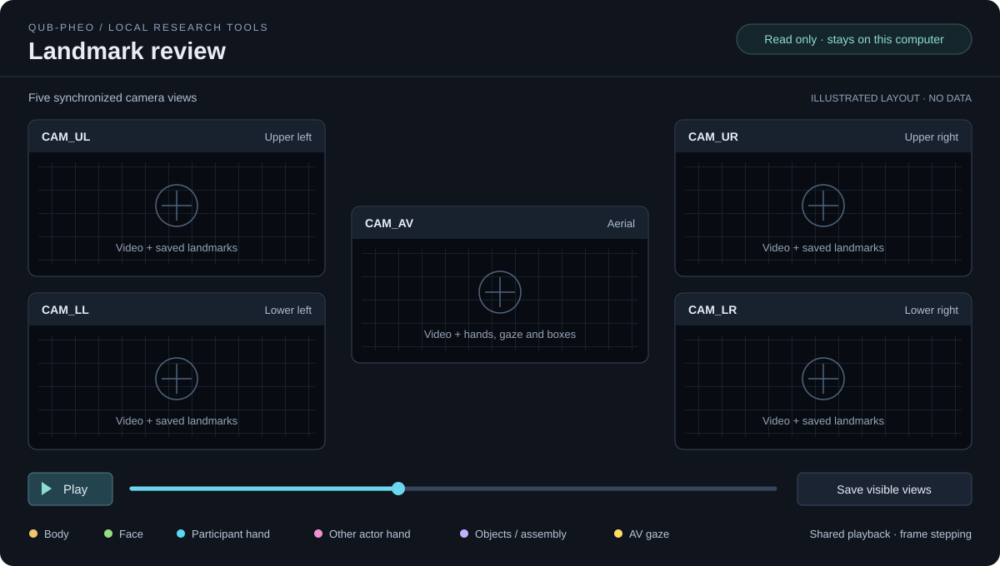

# Repository of Preprocessing of QUB-Perception of Human Engagement in assembly Operations Dataset (QUB-PHEO V1.0) 
[](https://doi.org/10.5281/zenodo.13956098)

## Introduction
<!-- Embed the GIF -->

## Visualiser

Explore synchronized **AV, UL, UR, LL and LR** videos and saved landmarks in a local browser viewer.

[](docs/visualiser.md)

*Illustrated desktop layout; no participant recordings or extracted landmarks are shown.*

- **Five views, one timeline:** aerial in the center, upper/lower cameras on each side. Also supports aerial-only and paired views.
- **Landmark overlays:** body, face, hands, aerial gaze and object/LEGO boxes where available in the saved files.
- **Review controls:** play/pause, frame stepping, scrubbing, playback speed and participant/task/filename filters.
- **Inspect and export:** hide source video for landmarks only, click a point for its coordinates and available score, or save the visible views as an image.
- **Runs locally:** reads your dataset without modifying it; no GPU or model checkpoints needed.

### Quick start

Use **Python 3.10–3.12** and install **FFmpeg** (`ffprobe` must be on `PATH`). From the cloned repository:

```bash
python3 -m venv .venv-viewer
.venv-viewer/bin/python -m pip install -r requirements-viewer.txt
cp .env.example .env
```

Set the dataset location in `.env`:

```dotenv
QUB_PHEO_DATASET_ROOT="/path/to/dataset"
QUB_PHEO_VIEWER_PORT=8767
```

The directory should contain `videos/<task>/*.mp4` and matching `landmarks/<task>/*.h5`. Dataset files are supplied separately; any subset of the five camera views is supported.

```bash
.venv-viewer/bin/python visualise.py --check
.venv-viewer/bin/python visualise.py
```

Open **http://127.0.0.1:8767/**. Use **Space** to play/pause and **← / →** to step through frames. Stop the server with **Ctrl+C**. Your `.env` is ignored by Git. `--check` checks configuration and filename matching; selected clips are validated when opened.

See the **[visualiser guide](docs/visualiser.md)** for Windows instructions, supported landmark formats, [historical LL/LR import](docs/visualiser.md#normalize-and-import-historical-lower-views), configuration and troubleshooting. If the port is occupied, use `python visualise.py --port 8770` and open the printed URL.

## Description
One of the core stages of efficient human-robot collaboration (HRC) is human-intention inference, enabling robots to anticipate and respond to human actions seamlessly. Existing approaches often rely on rule-based models or handcrafted heuristics, which lack adaptability to dynamic environments. In contrast, learning-based approaches leverage data-driven models to infer human intent, but their effectiveness depends on the availability of high-quality, multi-view datasets that capture rich spatial-temporal cues.
To address this, we introduce QUB-PHEO, a novel visual-based dyadic multi-view dataset designed to enhance intention inference in HRC. The dataset consists of synchronized multi-view recordings of 70 participants performing 36 distinct assembly subtasks, providing fine-grained labels for action recognition, gaze estimation, and object tracking. By enabling deep learning models to learn intent prediction from diverse viewpoints, QUB-PHEO paves the way for proactive and adaptive robotic collaboration in real-world settings.

QUB-PHEO and its methodology were published in [*IEEE Access* in 2024](https://doi.org/10.1109/ACCESS.2024.3485162).

## Preprocessing

For UL/UR landmark and LEGO extraction, see [the pipeline guide](docs/landmark_pipeline.md). It covers model prerequisites, a bounded comparison, resumable collection, hand refinement and evaluation. Source clips use `videos/<task>/<video-stem>.mp4`; delivered landmarks use `landmarks/<task>/<video-stem>.h5`. Extraction requires separately obtained checkpoints; the [visualiser](docs/visualiser.md) works with saved outputs without those models.

## Dataset access and licensing

### Dataset access / EULA

Follow the access instructions in the [QUB-PHEO dataset repository](https://github.com/exponentialR/QUB-PHEO). Download and complete the [QUB-PHEO End User License Agreement (PDF)](https://drive.google.com/file/d/15ciZPOGSz2PM0Bd3rrlV8ZRb3WikVSV2/view?usp=sharing), then send it to [s.mcloone@qub.ac.uk](mailto:s.mcloone@qub.ac.uk) for approval. Include the intended use and your research group or institution.

The linked EULA governs dataset access and use. Recordings and the agreement are supplied separately from this preprocessing repository.

### Preprocessing code

The [Zenodo record for the archived v1.1 code release](https://zenodo.org/records/13956098) lists Creative Commons Attribution 4.0 International in its license metadata. This checkout does not contain a standalone code `LICENSE` file. For clarification of licensing for the current code, contact [Samuel Adebayo](mailto:samueladebayo@ieee.org). Dataset access remains subject to the EULA above.

## What is in the Dataset
- The dataset contains the following:
  - `Annotations` folder: This folder contains the annotations for the dataset. The annotations are in the form of hdf5 files.
  - `Videos` folder: This folder contains the videos for the dataset. The videos are in the form of mp4 files.
  - `README.md` file: This file contains the description of the dataset.

For the access agreement and applicable terms, use the [dataset access and licensing](#dataset-access-and-licensing) links above.


## Citation
For the QUB-PHEO dataset and its published methodology, cite the paper:

```bibtex
@article{adebayo2024qubpheo,
  author  = {Samuel Adebayo and Se{\'a}n McLoone and Joost C. Dessing},
  title   = {{QUB-PHEO}: A Visual-Based Dyadic Multi-View Dataset for Intention Inference in Collaborative Assembly},
  journal = {IEEE Access},
  volume  = {12},
  pages   = {157050--157066},
  year    = {2024},
  doi     = {10.1109/ACCESS.2024.3485162}
}
```

The preprocessing repository is archived separately on Zenodo as [10.5281/zenodo.13956098](https://doi.org/10.5281/zenodo.13956098):

```bibtex
@misc{adebayo_exponentialrqub-hri_2024,
	title = {{exponentialR}/{QUB}-{HRI}: v1.1},
	shorttitle = {{exponentialR}/{QUB}-{HRI}},
	url = {https://zenodo.org/records/13956098},
	abstract = {Preprocessing Repository of QUB-Perception of Human Enagagement in Assembly Operations Dataset},
	urldate = {2024-10-19},
	publisher = {Zenodo},
	author = {Adebayo, Samuel},
	month = oct,
	year = {2024},
	doi = {10.5281/zenodo.13956098},
}
```
